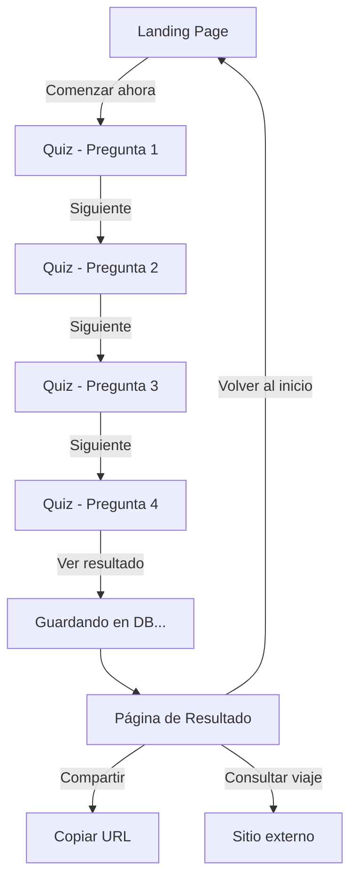

# 🌊 Onsen Match - Encuentra tu Onsen Ideal

Una aplicación web interactiva que ayuda a los usuarios a descubrir el tipo de onsen (aguas termales japonesas) perfecto según sus necesidades personales de salud, belleza y bienestar.


## 🎯 Propósito del Proyecto

**Onsen Match** es un sistema de quiz personalizado diseñado para:
- Ayudar a viajeros a Japón a elegir el tipo de onsen más beneficioso para ellos
- Educar sobre los diferentes tipos de aguas termales y sus propiedades
- Recomendar destinos específicos basados en preferencias personales
- Ofrecer una experiencia web moderna y atractiva con diseño "Zen Aqua"

El proyecto combina conocimiento tradicional japonés sobre onsens con tecnología web moderna para crear una experiencia educativa e interactiva.

---

## 🏗️ Arquitectura Técnica

### Stack Tecnológico

**Frontend:**
- ⚛️ **React 18** - Framework UI con componentes funcionales y hooks
- 📘 **TypeScript** - Tipado estático para mayor seguridad
- 🎨 **Tailwind CSS** - Framework CSS utility-first
- 🎭 **Shadcn UI** - Componentes UI accesibles y personalizables
- 🚀 **Vite** - Build tool ultra-rápido

**Backend (Lovable Cloud):**
- 🗄️ **PostgreSQL** - Base de datos relacional
- 🔐 **Row Level Security (RLS)** - Políticas de seguridad de datos
- 📊 **Supabase Client** - SDK para interacción con backend

**Routing:**
- 🛣️ **React Router v6** - Navegación client-side

### Estructura del Proyecto

```
onsen-match/
├── src/
│   ├── assets/              # Imágenes (hero + 10 tipos de onsen)
│   ├── components/
│   │   └── ui/             # Componentes Shadcn UI reutilizables
│   ├── data/
│   │   ├── questions.ts    # Preguntas del quiz con ponderaciones
│   │   └── onsenTypes.ts   # Descripciones y destinos de cada tipo
│   ├── pages/
│   │   ├── Index.tsx       # Landing page
│   │   ├── Quiz.tsx        # Página del quiz interactivo
│   │   ├── Result.tsx      # Página de resultados
│   │   └── NotFound.tsx    # Página 404
│   ├── types/
│   │   └── onsen.ts        # TypeScript types e interfaces
│   ├── utils/
│   │   ├── calculateResult.ts    # Algoritmo de cálculo
│   │   ├── sessionManager.ts     # Gestión de sesiones anónimas
│   │   ├── saveQuizData.ts       # Funciones para guardar datos
│   │   └── onsenImages.ts        # Mapeo de imágenes
│   ├── integrations/
│   │   └── supabase/       # Cliente y types de Supabase (auto-generado)
│   ├── index.css           # Estilos globales y design system
│   ├── App.tsx             # Configuración de rutas
│   └── main.tsx            # Entry point
├── supabase/
│   └── migrations/         # Migraciones SQL de base de datos
├── public/
│   └── robots.txt          # SEO configuration
└── README.md               # Este archivo
```

---

## 🧮 Cómo Funciona el Algoritmo

### Sistema de Ponderaciones

El algoritmo utiliza un **sistema de scoring basado en ponderaciones** para determinar el tipo de onsen ideal:

1. **Preguntas** (4 total):
   - Cada pregunta tiene múltiples opciones de respuesta
   - Ubicadas en `src/data/questions.ts`

2. **Opciones**:
   - Cada opción tiene ponderaciones para 1-3 tipos de onsen
   - Las ponderaciones van de 1 a 3 puntos
   - Formato: `{ chloride: 3, sulfate: 2, simple: 1 }`

3. **Cálculo** (`src/utils/calculateResult.ts`):
   ```typescript
   // Pseudocódigo
   scores = {}
   
   for each answer in userAnswers:
     option = findOption(answer)
     for each (onsenType, weight) in option.weights:
       scores[onsenType] += weight
   
   result = onsenType with highest score
   ```

4. **Resultado**:
   - El tipo con mayor puntuación total es el resultado
   - Se muestra descripción, imagen y destinos recomendados

### Ejemplo de Ponderación

```typescript
{
  id: 1,
  text: '¿Cómo se siente tu cuerpo últimamente?',
  options: [
    {
      id: '1a',
      text: 'Me siento cansado/a, con estrés',
      weights: { 
        radon: 3,      // Mejor opción
        simple: 2,     // Segunda opción
        alkaline: 2    // Segunda opción
      }
    }
  ]
}
```

---

## 💾 Base de Datos (Lovable Cloud)

### Tablas

#### `quiz_results`
Almacena los resultados finales del quiz:
```sql
- id (UUID, PK)
- session_id (UUID) - Tracking de usuarios anónimos
- onsen_type (TEXT) - Tipo resultante
- answers (JSONB) - Todas las respuestas del usuario
- created_at (TIMESTAMP)
```

#### `quiz_attempts`
Registra cada respuesta individual:
```sql
- id (UUID, PK)
- session_id (UUID)
- question_id (INTEGER)
- selected_option_id (TEXT)
- created_at (TIMESTAMP)
```

### Gestión de Sesiones

- **UUID persistente** en `localStorage`
- Permite tracking sin autenticación
- Funciones en `src/utils/sessionManager.ts`

---

## 🎨 Sistema de Diseño "Zen Aqua"

### Paleta de Colores

```css
/* Zen Aqua Theme */
--primary: Turquesa vibrante (HSL)
--secondary: Ámbar cálido
--accent: Menta eléctrica
--background: Gradientes suaves
```

### Tipografía

- **Sans-serif**: Inter (cuerpo)
- **Serif**: Noto Serif JP (títulos)
- Sistema responsive con `clamp()`

### Efectos Visuales

- 🌫️ Glassmorphism en tarjetas
- ✨ Animaciones suaves (fade, scale, slide)
- 🎭 Dark mode completo
- 📱 Diseño 100% responsive

---

## 🔧 Cómo Personalizar

### 1. Cambiar las Preguntas

**Archivo:** `src/data/questions.ts`

```typescript
export const questions: Question[] = [
  {
    id: 1,  // Único
    text: 'Tu pregunta aquí',
    description: 'Descripción opcional',
    options: [
      {
        id: '1a',  // Único dentro de la pregunta
        text: 'Opción 1',
        weights: { 
          chloride: 3,  // 1-3 puntos
          sulfate: 2 
        }
      }
    ]
  }
];
```

**Tips:**
- Mantén 3-5 preguntas para mejor UX
- Asegúrate que todos los tipos de onsen sean alcanzables
- Ponderaciones más altas (3) = mayor influencia en resultado

### 2. Ajustar Tipos de Onsen

**Archivo:** `src/data/onsenTypes.ts`

```typescript
export const onsenResults: Record<OnsenType, OnsenResult> = {
  chloride: {
    type: 'chloride',
    title: 'Tu título personalizado',
    description: 'Descripción detallada...',
    destinations: ['Destino 1', 'Destino 2', 'Destino 3']
  }
};
```

### 3. Cambiar Imágenes

**Ubicación:** `src/assets/onsen-[type].jpg`

1. Reemplaza la imagen en `src/assets/`
2. Mantén el mismo nombre de archivo
3. Resolución recomendada: 1024x576px (16:9)

**O generar nuevas con IA:**
```typescript
// Las imágenes actuales fueron generadas con Flux.schnell
// Puedes usar la misma herramienta o cualquier generador de imágenes IA
```

### 4. Personalizar Diseño

**Archivo:** `src/index.css`

Modifica las variables CSS:
```css
:root {
  --primary: [tu color HSL];
  --secondary: [tu color HSL];
  --background: [tu color HSL];
  /* ... más variables */
}
```

**Archivo:** `tailwind.config.ts`

Ajusta la configuración de Tailwind para cambios más profundos.

---

## 🚀 Deployment

### Opción 1: Lovable (Recomendado)

1. Haz clic en **"Publish"** en el editor de Lovable
2. Tu app estará disponible en `https://[tu-proyecto].lovable.app`
3. Conecta un dominio personalizado en Settings → Domains (requiere plan de pago)

### Opción 2: GitHub + Vercel/Netlify

1. **Transferir a GitHub:**
   - Clic en el botón de GitHub en Lovable
   - Conecta tu cuenta y transfiere el código

2. **Deploy en Vercel:**
   ```bash
   # Install Vercel CLI
   npm i -g vercel
   
   # Deploy
   vercel
   ```

3. **Variables de entorno requeridas:**
   ```
   VITE_SUPABASE_URL=tu_url
   VITE_SUPABASE_PUBLISHABLE_KEY=tu_key
   ```

### Opción 3: Docker

```dockerfile
# Crear Dockerfile en la raíz
FROM node:18-alpine
WORKDIR /app
COPY package*.json ./
RUN npm install
COPY . .
RUN npm run build
EXPOSE 4173
CMD ["npm", "run", "preview"]
```

```bash
docker build -t onsen-match .
docker run -p 4173:4173 onsen-match
```

---

## ✨ Características Principales

### ✅ Completado
- [x] Sistema de quiz interactivo de 4 preguntas
- [x] 10 tipos de onsen diferentes con imágenes únicas
- [x] Algoritmo de cálculo basado en ponderaciones
- [x] Base de datos con tracking de sesiones anónimas
- [x] Guardado automático de respuestas y resultados
- [x] Página de resultados con imagen hero y destinos
- [x] Botón de compartir resultado
- [x] Diseño responsive (mobile, tablet, desktop)
- [x] Dark mode completo
- [x] Glassmorphism y animaciones suaves
- [x] SEO optimizado (meta tags, alt texts)

### 🔮 Ideas para Futuras Mejoras
- [ ] Página de historial de resultados (`/history`)
- [ ] Comparador de tipos de onsen (`/types`)
- [ ] Autenticación opcional para usuarios
- [ ] Sistema de favoritos
- [ ] Internacionalización (inglés, japonés)
- [ ] Integración con API de mapas para mostrar ubicaciones
- [ ] Blog con artículos sobre cultura onsen
- [ ] Sistema de reseñas de usuarios

---

## 📊 Flujo de Usuario



---

## 🔐 Seguridad y Privacidad

- ✅ **RLS habilitado** en todas las tablas
- ✅ **Políticas públicas** (usuarios anónimos pueden INSERT/SELECT)
- ✅ **No se recopila PII** (información personal identificable)
- ✅ **Session ID aleatorio** en localStorage
- ✅ **HTTPS** forzado en producción
- ✅ **CORS configurado** correctamente

---

## 🧪 Testing

### Probar todos los resultados posibles

Para verificar que todos los 10 tipos de onsen son alcanzables:

```typescript
// src/utils/calculateResult.test.ts
import { calculateOnsenType } from './calculateResult';

// Test case para cada tipo
const testCases = {
  chloride: { 1: '1b', 2: '2d', 3: '3a', 4: '4b' },
  bicarbonate: { 1: '1e', 2: '2a', 3: '3b', 4: '4b' },
  // ... más casos
};
```

### Test manual
1. Completa el quiz varias veces con diferentes combinaciones
2. Verifica que la base de datos guarda correctamente
3. Prueba el botón de compartir
4. Verifica responsive en diferentes dispositivos

---

## 🛠️ Comandos de Desarrollo

```bash
# Instalar dependencias
npm install

# Servidor de desarrollo
npm run dev

# Build para producción
npm run build

# Preview del build
npm run preview

# Linting
npm run lint
```

---

## 📝 Licencia y Créditos

**Desarrollado con:**
- [Lovable](https://lovable.dev) - Plataforma de desarrollo
- [React](https://react.dev) - Framework UI
- [Tailwind CSS](https://tailwindcss.com) - CSS Framework
- [Shadcn UI](https://ui.shadcn.com) - Componentes UI
- [Supabase](https://supabase.com) - Backend as a Service

**Imágenes generadas con:**
- Flux.schnell - Modelo de IA para generación de imágenes

---

## 📞 Soporte y Contacto

Para consultas sobre viajes a Japón y experiencias onsen:
- 🌐 [Japón Tours en Español](https://japontoursenespanol.com/)

---

## 🎓 Recursos de Aprendizaje

### Sobre Onsens
- [Guía oficial de turismo de Japón](https://www.japan.travel/)
- [Tipos de aguas termales japonesas](https://www.japan.travel/es/guide/onsen-etiquette/)

### Tecnologías Usadas
- [Documentación de React](https://react.dev)
- [Documentación de Lovable](https://docs.lovable.dev)
- [Guía de Tailwind CSS](https://tailwindcss.com/docs)

---

**¡Disfruta descubriendo tu onsen ideal! 🌊♨️**
